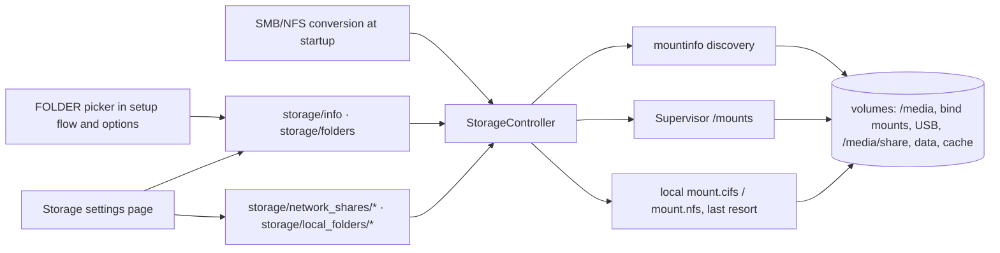

# Storage locations and one Local files provider: technical plan

Status: proposal, 2026-09-17. Owner: Marcel van der Veldt. This document is the technical
companion of the "Local files: pick where your music lives" epic on the project board. It is
written so it can be fed to an agent for implementation; every claim marked "verified" was
checked in the referenced code (server at `8756e45a3`, add-on repo, Supervisor source).

## Summary

Music Assistant (MA) learns which storage it has. A new core controller lists the volumes the
server can see (bind mounts in Docker, the `/media` folder and every network share the Home
Assistant Supervisor mounted, USB drives on Music Assistant OS), mounts network shares through
the Supervisor where one exists, and only as a last resort runs `mount` itself. The three local
file providers (`filesystem_local`, `filesystem_smb`, `filesystem_nfs`) collapse into one
"Local files" source whose setup asks "where is it stored?" with a picker instead of a path
field. Existing SMB/NFS sources convert automatically with their library intact. The Home
Assistant add-on can then drop `SYS_ADMIN` and `DAC_READ_SEARCH`, which it only carries for
in-container mounting today.

Decisions taken with the maintainer (2026-09-16/17): mounts go through the Supervisor API on
Home Assistant OS and later Music Assistant OS (add-on gets `hassio_api` + `hassio_role:
manager`, first task); SMB/NFS instances are converted automatically and the two providers are
removed; members may add a source on an existing location, nobody types a path in the picker;
WebDAV, Google Drive and OneDrive stay separate; a new `ConfigEntryType.FOLDER` with a frontend
picker; the storage view also shows the data and cache directories; everything lands together.

## Requirements

- One user-facing "Local files" source for local disk, SMB and NFS. Cloud and WebDAV sources
  stay what they are.
- Setup picks a storage location and optionally a subfolder. No free-text server path in the
  setup flow. Bare-metal and dev installs can register a folder on the Storage page.
- Storage locations are a core concept with an API, a settings page and a folder picker.
- Network shares are mounted by the Supervisor on HAOS/MAOS, by MA itself only where nothing
  better exists and the process is allowed to (Docker with capabilities, bare metal as root).
- The add-on drops its mount privileges once the conversion has shipped.
- Members (`config.providers.own`) may add a source on an existing media location; mounting and
  registering folders is admin work.
- Existing library data survives: instance ids stay, provider mappings stay valid.
- Nothing may become a general server file browser or a way to download provider audio.

## Architecture

### 1. Storage core controller (server, `music_assistant/controllers/storage/`)

`StorageController(CoreController)`, domain `storage`. Registered in `_load_core_controllers`,
`_register_api_commands` (the tuple at `mass.py:1189`, verified: a controller missing there has
no commands) and the `stop()` order. Not in `CONFIGURABLE_CORE_CONTROLLERS`: the dedicated
frontend page replaces the generic core settings page.

Files: `controller.py`, `models.py`, `constants.py`, `backends/mountinfo.py`,
`backends/supervisor.py`, `backends/local_mount.py`, `strings.json`. New `helpers/hassio.py`
(`supervisor_token()`, `supervisor_request()`), also adopted by the discovery controller, which
today is the only Supervisor REST caller (`controllers/discovery/controller.py:475-500`,
verified).

`StorageLocation` (server-side dataclass, serialized by the API as is; the frontend hand-writes
its TypeScript interface, so no models change):

| field | meaning |
|---|---|
| `path` | absolute path inside the MA process. This is the location's identity. |
| `name` | display name (mount basename, share name, "Media folder") |
| `usage` | `media`, `data` or `cache` |
| `kind` | `builtin_media`, `container_volume`, `network_share`, `removable`, `local_disk`, `manual` |
| `mountpoint` | the mount backing the location, probed with `ismount` |
| `fstype`, `read_only`, `available`, `free_space_gb` | best effort, from mountinfo / `statvfs` |
| `managed`, `backend` | MA created it (network share or registered folder) and which backend owns it |
| `share_type`, `server`, `share` | non-secret connection details of a managed share |
| `error` | why a managed share is not mounted, localized |

Persisted server state in `settings.json`: `storage_shares` (a map name → `NetworkShareSpec`:
`share_type`, `server`, `share` or export path, `username`, `password`, `version`, `read_only`;
secrets encrypted with `config.encrypt_string`, exactly like provider `setup_data`) and
`storage_folders` (a list of admin-registered paths, kind `manual`).

Data and cache rows: `usage` data/cache with path, used size and free space, read-only, admin
only, filtered out of every music picker. They give the Storage page the whole picture and a
future home for MAOS data-disk actions.

### 2. Backends

Fixed priority, probed once at setup, re-probed lazily when a mount command finds the cached
capability unavailable.

**Supervisor backend.** Active when a Supervisor is reachable: `is_hass_supervisor()`
(`helpers/util.py:1389`, verified: `SUPERVISOR_TOKEN` plus a 401 from `http://supervisor/core`)
holds for the HA add-on and for MAOS, which runs the real Supervisor without HA Core. Then `GET
http://supervisor/mounts` must answer 200 (403 means the add-on manifest has no manager role).
Verified in the Supervisor source:

- `/mounts.*`, `/hardware/.+` and `/host/.+` are in the manager role regex
  (`supervisor/api/middleware/security.py`); no smaller role covers `/mounts`.
- Payload: `name` matching `^[A-Za-z0-9_]+$` and unique, `type` cifs or nfs, `usage` media, share
  or backup, `server`, cifs `share` (no `/` or `\`), nfs `path`, optional `username`+`password`
  (both or neither; without them the Supervisor mounts as `guest`), cifs `version` only `1.0`
  or `2.0` (anything else must be omitted, the Supervisor then auto-negotiates), `read_only`,
  optional `port` (`supervisor/mounts/validate.py`, `mounts/mount.py`).
- A `usage: media` mount lands at `/media/<name>` inside every add-on that maps `media`
  (`Mount.where()`); the MA add-on already maps `media:rw`. `GET /mounts` never returns
  secrets (`to_dict(skip_secrets=True)`). The Supervisor adds `noserverino` itself; there is no
  field for other mount options.

Mount = `POST /mounts` with `usage: media`; path `/media/<name>`. Name allocation: sanitized
share slug (`[^A-Za-z0-9_]` → `_`, lower-cased, trimmed), `_2`, `_3` suffix on collision with
MA's own records and with `GET /mounts`; a user-created mount with the same `(type, server,
share)` is reused, never duplicated. `PUT /mounts/<name>` for edits, `POST /mounts/<name>/reload`
for reload, `DELETE` for removal.

**Local mount backend (last resort).** Linux, `os.geteuid() == 0`, `mount.cifs` and/or
`mount.nfs` on the path. The command builders move verbatim out of the two providers into
`helpers/mount.py` as pure functions (`build_cifs_mount_cmd`, `build_nfs_mount_cmd`,
`classify_mount_error`; today at `providers/filesystem_smb/__init__.py:232-305` with the
password in the `PASSWD` environment variable, and `providers/filesystem_nfs/provider.py`).
Mount root `/tmp/music-assistant-mounts/<name>`: outside the data directory so no backup walks a
NAS, same tmpfs the providers use today (`/tmp/<instance_id>`), a mountpoint costs no RAM. No
capability parsing: an `EPERM` at mount time becomes a translated error with a docs link.

**Mountinfo discovery.** Always on, Linux. A pure function of the contents of
`/proc/self/mountinfo` (format: `id parent maj:min root mountpoint options - fstype source
superopts`, octal escapes in the mountpoint). Verified on the MAOS spike VM and in the
Supervisor's `docker/app.py`: the add-on's `/media` is bound `rslave` from the host, so each
Supervisor mount and each udev automount appears as its own line with its real fstype. A line
survives only if all of:

1. fstype in the allowlist: `ext2 ext3 ext4 xfs btrfs f2fs zfs vfat exfat ntfs ntfs3 fuseblk
   hfsplus apfs iso9660 udf cifs smb3 nfs nfs4 fuse.* virtiofs 9p`. Never `overlay` (the container
   root), `tmpfs`, `proc`, `sysfs`, `cgroup*`, `devpts`, `squashfs`.
2. the mountpoint is a directory (drops the `/etc/hosts`, `/etc/hostname`, `/etc/resolv.conf`
   file binds every container has),
3. not `/`, not under `/proc /sys /dev /run /etc /var /usr /boot /snap`,
4. not `/data /ssl /config /addons /backup /share` and not `mass.storage_path` or
   `mass.cache_path`.

Kind: `cifs|smb3|nfs|nfs4` → `network_share`; `/media` under a Supervisor → `builtin_media`;
`vfat|exfat|ntfs*|hfsplus|iso9660|udf` or a mountpoint under `/media/` → `removable`; otherwise
`container_volume` inside a container (`/.dockerenv`, `/run/.containerenv` or a Supervisor) and
`local_disk` on bare metal. Duplicate mountpoints: last line wins. `read_only` from `ro` in the
per-mount options. No `poll()` watcher: a 60 s refresh timer plus a refresh after every mount
command is indistinguishable in practice.

macOS and Windows: no discovery. Admins register a folder on the Storage page.

### 3. Controller behaviour

- `reconcile()`: mount every managed share through the winning backend. Idempotent, never
  raises. A share that cannot be mounted right now stays an unavailable location carrying its
  error; the next pass or the next command tries again. The music source bound to it fails to
  load with a translated reason and comes back through the server's existing provider retry
  loop (10/30/60/120 s, `mass.py:1040-1085`, verified).
- `refresh()`: rebuild the location cache from discovery plus managed shares and registered
  folders; managed entries win on a path collision.
- `is_available(path)`: `ismount` on the backing mountpoint and `isdir` on the path. The
  provider's 300 s availability probe (`providers/filesystem_local/__init__.py:2096`) calls this
  instead of bare `isdir`: an unmounted Supervisor share leaves an empty `/media/<name>`
  directory behind (verified on the spike VM), and a USB unplug on MAOS leaves the mountpoint
  directory too.
- Removing a share or a registered folder is refused while a loaded source uses it.
- `close()` does not unmount: a Supervisor mount outlives an add-on restart by design, and a
  local mount torn down on every restart only costs a remount.

Visibility: members see media locations of kinds `builtin_media`, `container_volume`,
`network_share`, `removable`. Admins see everything, including bare-metal `local_disk`
discovery, registered folders and the data/cache rows.

### 4. API (`API_SCHEMA_VERSION` 77 → 78)

| command | scope | notes |
|---|---|---|
| `storage/info` | any of `CONFIG_PROVIDERS_OWN`, `CONFIG_PROVIDERS_READ` | locations filtered by caller, plus `can_mount_shares`, `mount_backend`, `supported_share_types`, `can_add_local_folder` (true only without a container and without a Supervisor) |
| `storage/folders(path)` | same | immediate subfolders, sorted, capped. Bounded to media locations the caller may see: `realpath` plus lexical containment (`helpers/security.py is_safe_path`), directories only, `follow_symlinks=False`, dotfiles skipped. Never a general file browser. |
| `storage/network_shares/add` | `CONFIG_PROVIDERS_WRITE` | `share_type, server, share, username, password, version, read_only`; validation reuses today's checks: `get_ip_from_host`, cifs share without slashes, nfs export absolute and safe |
| `storage/network_shares/update` | `CONFIG_PROVIDERS_WRITE` | unmount, rewrite, remount, roll back on failure |
| `storage/network_shares/remove` | `CONFIG_PROVIDERS_WRITE` | refused while in use |
| `storage/network_shares/reload` | `CONFIG_PROVIDERS_WRITE` | remount |
| `storage/local_folders/add(path)` | `CONFIG_PROVIDERS_WRITE` | refused unless `can_add_local_folder`; `isdir` checked; stored in `storage_folders` |
| `storage/local_folders/remove(path)` | `CONFIG_PROVIDERS_WRITE` | refused while in use |

`api_command`'s `required_scope` accepts a tuple meaning any-of (`helpers/api.py:44`,
verified). `CONFIG_PROVIDERS_WRITE` is the scope that already means "manage every music source";
mounting a share for the whole home is exactly that.

### 5. Models package (`music-assistant/models`)

One enum member: `ConfigEntryType.FOLDER`, value type `str` (an absolute path). Docstring: a
folder on the server, picked from the storage locations; clients without a picker show a text
field. Verified: the frontend renderer falls through to a plain text field for any type it has
no branch for (`src/views/settings/ConfigEntryField.vue`, fallback branch), so old clients keep
working. Release the models package, pin it in the server.

### 6. One Local files setup flow (server, `providers/filesystem_local/setup_flow.py`)

Domain stays `filesystem_local`, so nothing about existing local instances changes.
`setup_data` stays `{content_type, path}`. Manifest `self_service: true` (today `false`, the only
manifest in the tree that sets it, verified) so members can start the flow.

`SetupFlowContext` (server-side, `music_assistant/models/setup_flow.py`) gains
`manages_all_sources: bool = True`, set in `setup_provider` and `reconfigure_provider`
(`controllers/config/flows.py`) from `_access_caller()`. Today a flow could read
`get_current_user()` because the flow task copies the caller's contextvars, but that is invisible
and untestable; the explicit field is the contract.

One form step: the content type radio and a `path` entry of type `FOLDER` (default `/media`
where it exists). The step description (markdown): "Music on a NAS? Add the share under Storage
settings first, then pick it here." with a link to the Storage page. Reconfigure prefills the
stored path; the picker shows it even when it matches no location.

Server-side guards at finish, because `ConfigEntry.parse_value` does not validate a submitted
value against `options` (verified in `music_assistant_models/config_entries.py:304-383`; the
picker alone proves nothing):

- the path must lie inside a media location the caller may see (`AbortFlow("not_allowed")`),
- and be an existing directory (`music_directory_not_found` re-renders the form),
- on reconfigure an unchanged stored path skips the location check, so a legacy instance whose
  folder is not a location yet keeps working until the admin registers the folder.

`handle_async_init` distinguishes "location not available (yet)" from "path does not exist".

### 7. Frontend (`music-assistant/frontend`)

- `FolderPickerField.vue` rendered for `ConfigEntryType.FOLDER` from `ConfigEntryField.vue`, so
  setup flows and the options page both get it: media locations from `storage/info` (name,
  path, kind badge, unavailable state), click to browse through `storage/folders`, breadcrumb,
  "Use this folder". No free-text path.
- Storage settings page: entry in `src/helpers/settings_sections.ts`, route in
  `src/plugins/router.ts`, view under `src/views/settings/`, gated on `minServerVersion` and a
  `STORAGE_SCHEMA_VERSION = 78` getter in `src/plugins/api/index.ts` (both existing patterns,
  verified). Locations grouped by usage (media, then data/cache with free space), per managed
  share Reload / Edit / Remove, "Add network share" dialog (type, server, share or export,
  credentials, version behind an advanced toggle), "Add a folder on this server" shown only when
  `can_add_local_folder`, an explainer card with a docs link when nothing can mount.
- `interfaces.ts` types, `POPULAR_PROVIDERS` cleanup in `AddProviderDialog.vue` (it lists
  `filesystem_smb` today). shadcn/Tailwind only, screenshots in the PR.
- Known limits, follow-ups: markdown links in a step description open a new tab (the DOMPurify
  hook forces `target=_blank`, verified in `src/helpers/utils.ts`); an in-app link entry type is
  a later models + frontend change. No storage event in v1; MAOS hot-plug can add one.

### 8. Add-on (`music-assistant/home-assistant-addon`, all four channel directories)

Today (verified): `map: [media:rw, ssl:ro]`, `privileged: [SYS_ADMIN, DAC_READ_SEARCH]`, no
`hassio_api`, AppArmor profile with `mount`, `umount`, `remount`, `capability sys_admin`,
`capability dac_read_search` lines below a bare `capability,` and `file,`. The nightly directory
has no `apparmor:` key at all.

- PR 1, now: `hassio_api: true` and `hassio_role: manager` in `music_assistant`,
  `music_assistant_beta`, `music_assistant_dev`, `music_assistant_nightly`. Harmless before the
  server change; prepares every channel, including the dev add-on that clones the server at
  runtime.
- PR 2, in lockstep with the server release that carries the conversion: drop `privileged` and
  the AppArmor mount and capability lines. The bare `capability,` and `file,` lines make the
  profile change cosmetic; a real profile is a separate task.

Honest framing for the PR descriptions: today's add-on already has `host_network` and
`SYS_ADMIN`, so the manager role is a lateral trade, not a hardening win by itself. The win is
that MA no longer needs to be privileged, which makes later hardening possible, and that NAS
credentials and mounts live where HA users already manage them.

### 9. Docs (`music-assistant.io`)

- `installation`: rewrite "Advanced: mounting SMB/network shares inside the container". Order:
  add-on users add the share in MA's Storage settings (the Supervisor mounts it); Docker users
  mount on the host and bind into the container (`-v /mnt/nas/music:/media/music`), MA
  discovers it; in-container mounting is the last resort, with the capability flags and why it
  is discouraged.
- `music-providers/local-files`: one provider, pick a location, SMB and NFS folded in, keep the
  old anchors (`CONF_ENTRY_MISSING_ALBUM_ARTIST.help_link` points at
  `local-files/#tagging-files`, verified).
- A short "Storage locations" section: what they are, where they come from per install type,
  what "via Home Assistant" means, the trade-offs below.

## Conversion of existing SMB and NFS sources

`controllers/config/filesystem_consolidation.py`, called from `MusicAssistant.start()` right
after `migrate_provider_access` (same phase as `provider_access_migration.py` and
`retired_local_audio.py`: databases exist, no provider has loaded yet). Marker
`CONF_FILESYSTEM_SOURCES_CONSOLIDATED`, at most once, never raises. It is pure data: it never
mounts. A NAS that is asleep at boot must not turn a good configuration into a failure with
nowhere to retry from.

Per instance with `domain` in `filesystem_smb`, `filesystem_nfs`:

1. Decrypt `setup_data` (`config.decrypt_string`). Unreadable: log a warning with the instance
   id, leave the raw config untouched. Such an instance could not load today either.
2. Build the `NetworkShareSpec`. SMB: cifs, `host`, `share`, `username` (empty or `guest` →
   none), `password`, `smb_version` mapped to `1.0`/`2.0` or omitted. NFS: `host`,
   `export_path`, `nfs_version`. Subfolders never go into the share: the SMB `subfolder`
   (appended to the UNC today, `filesystem_smb/__init__.py:169-176`) and the post-2.10 NFS
   "subfolder inside the mount" (`filesystem_nfs/provider.py:71-83`, verified) become a path
   suffix.
3. Reuse an existing `storage_shares` record with the same `(type, server, share)`; else, when
   the Supervisor backend is available, reuse a user-created mount that matches (best effort
   `GET /mounts`); else allocate a name and store the spec, secrets encrypted.
4. Compute the path from the winning backend without mounting: `/media/<name>` or
   `/tmp/music-assistant-mounts/<name>`, plus the subfolder suffix, normalized.
5. Rewrite the provider config in place. `domain` → `filesystem_local`; `setup_data` →
   `{content_type, path}` re-encrypted, every other key dropped; `name` → today's rendered name
   (verified: names are computed at runtime as `manifest.name [postfix]`, so without an explicit
   name every converted share would read "Filesystem (local disk) [music]"); `last_error` →
   none; the `access` block and the instance id untouched. Never `remove_provider_config`:
   `cleanup_provider` records the id in `CONF_DELETED_PROVIDERS` and `music.setup()` replays
   that list on every start, wiping the library rows before this step even runs
   (`controllers/music/controller.py:349-353`, `:2133-2199`, verified).
6. One statement: `UPDATE provider_mappings SET provider_domain = 'filesystem_local' WHERE
   provider_instance IN (...)`. Required: `_available_filesystem_domains()` in
   `controllers/streams/audio_analysis.py:1180-1186` keeps only domains a loaded provider
   reports, and the candidate queries filter on `pm.provider_domain`; stale rows would drop
   every converted track from background analysis for good, and `_check_provider_mappings`
   never compares the domain, so the rows would not self-heal (verified).
7. Save, set the marker, save.

Also in the same PR:

- Delete `filesystem_local` from `PROVIDER_SETUP_FLOW_DEFAULTS`
  (`controllers/config/migrations.py:484`). That per-boot step injects `path: /media` into any
  `filesystem_local` config without a path; on the add-on `/media` exists and is non-empty, so
  the empty-scan guard does not fire and `_process_deletions` would replace the old library
  under the same instance id (verified chain).
- Delete the `filesystem_smb` and `filesystem_nfs` packages, their test folders
  (`scripts/check_test_layout.py` enforces the layout), and their generated translation keys.
  Update `controllers/streams/audio_analysis.py:85-91` (`FILESYSTEM_PROVIDER_DOMAINS`) and
  `controllers/music/media/genres.py:1716` (which omits `filesystem_nfs` today, so NFS sources
  gain genre propagation). Leave `PROVIDER_SETUP_FLOW_KEYS` and the historical SQL in
  `controllers/music/migrations.py` untouched: shipped migrations are never edited.
- `tests/providers/filesystem/test_manifest.py` inverts its `self_service` assertion.

Verified as safe: no music-provider code derives the domain from an instance id (`split("--")`
appears only in player code and a test helper); `ProviderAccess` records and ownership are keyed
by instance id; `match_provider_instances` and the own-account playback rules skip non-streaming
providers, so converted instances do not cross-map or substitute for each other; the
duplicate-track reconciliation keys on domain, and collapsing domains only narrows its candidate
set.

## Trade-offs to state in release notes and docs

- Supervisor mounts have no options field. Converted shares lose MA's `nocase`, `actimeo=30`,
  `noperm`, `nobrl`, `mfsymlinks` and the user-visible `cache=` mode. Expect slower metadata
  walks on very large libraries over slow links and different behaviour around case and
  symlinks. Upstream ask candidate: mount options on the Supervisor mounts API.
- The whole share sits at `/media/<name>` on the host, visible to HA's media browser and to
  every add-on that maps `media`. Today it is mounted inside MA's container only.
- Two local instances with the same relative item ids merge on the library's domain fallback
  (`controllers/music/media/base.py:761-835`), as two `filesystem_local` instances already do.
- The SMB `cache_mode` option disappears.

## Rollout

1. Add-on PR 1 (Supervisor access). Models PR (`FOLDER`), release, pin.
2. Server PRs in order: storage core with discovery, `storage/info`, `storage/folders` and the
   visibility rules; backends and share commands (`helpers/hassio.py`, `helpers/mount.py` move);
   the setup flow; the conversion with the provider removal. Frontend PRs in parallel once the
   API shape is merged. Docs PR.
3. Release. Add-on PR 2 (drop privileges) in the same release window.
4. MAOS: backlog#98 re-scoped on top of this base (udev automount rules in the OS image,
   auto-add a source per drive, eject through the host API).

## Sketches

Setup flow, one step:

```
Add Local files
 What do you want to add?      (•) Music  ( ) Audiobooks  ( ) Podcasts  ( ) Sound effects
 Where is it stored?
   ┌ Folder picker ──────────────────────────────────────────────────────────────────────┐
   │ Media folder     /media           Home Assistant media   ▸                          │
   │ NAS Music        /media/music     SMB //mynas/music      ▸                          │
   │ SANDISK          /media/SANDISK   USB drive              ▸                          │
   │ ── browsing /media/music ──   Albums ▸   Audiobooks ▸   Podcasts ▸   [Use this folder] │
   └─────────────────────────────────────────────────────────────────────────────────────┘
 Music on a NAS? Add the share under Storage settings first, then pick it here.
                                                                       [Cancel] [Add]
```

Storage settings page:

```
Settings > Storage
 Music locations
  Media folder   /media          Home Assistant media folder            available
  NAS Music      /media/music    SMB //mynas/music, via Home Assistant  [Reload] [Edit] [Remove]
  SANDISK        /media/SANDISK  USB drive                              available
  [Add network share]   [Add folder on this server]   (the latter only on bare metal / dev)
 Server storage
  Data           /data           12.4 GB used · 41 GB free
  Cache          /data/.cache    3.1 GB used
 [!] when nothing can mount: "This install cannot mount shares. Mount them on the host and
     bind them into /media. Docs →"
```

Components:



## Test plan

- Mountinfo parser as a pure function on captured fixtures: HAOS add-on with two Supervisor
  mounts, `/media` bind and `/data`; plain Docker with one `-v`; plain Docker with none; a bare
  host. Assert pseudo filesystems and file binds excluded, `/data`, `/ssl`, `/config` excluded,
  shadowed mountpoint dedupe, `ro`, kind classification.
- Supervisor backend against a fake Supervisor on an aiohttp test server (precedent:
  `tests/test_webserver_auth.py`): probe 200 and 403, add, name collision → `_2`, guest without
  credentials, version omitted for anything but `1.0`/`2.0`, delete of a missing mount tolerated.
- `helpers/mount.py` command builders and `classify_mount_error` as pure functions (the
  assertions from `tests/providers/filesystem_nfs/test_mount.py` move here).
- Folder listing on a real temporary tree: `../`, absolute path outside every location, a
  symlink pointing outside, dotfiles, the cap. Local folder registration refused inside a
  container and under a Supervisor.
- `reconcile()` with two shares of which one fails: the other mounts, no exception escapes, a
  second pass is a no-op.
- Setup flow driven with a stubbed session (precedent:
  `tests/providers/fastmcp_server/test_setup_flow.py`): a path inside a location finishes with
  `{content_type, path}`; a path outside every location is refused for members and admins; a
  member does not see local-disk locations; reconfigure keeps an unchanged legacy path.
- Conversion against a real `ConfigController` on a temporary settings file plus an in-memory
  library database (precedent: `tests/providers/filesystem/test_content_type_resolution.py`):
  one SMB and one NFS instance convert, ids unchanged, subfolder becomes a suffix, names set,
  `provider_mappings.provider_domain` updated, marker prevents a second run, an unreadable
  instance is left alone while the others convert, an existing record is reused, Supervisor
  versus local path, a plain local instance is untouched.

## Verification

- Fresh HA add-on install: add a network share on the Storage page, it appears under
  `/media/<name>` and in HA's own Storage settings, the Local files flow offers it, a source on a
  subfolder syncs.
- Upgrade of an add-on with an SMB and an NFS source: both sources come back under the same
  names with their library intact, the mounts exist in the Supervisor, background audio
  analysis still lists their tracks, the add-on runs without `SYS_ADMIN`.
- Docker with `-v /host/music:/media/music` and no capabilities: the volume is a location, the
  Storage page explains that shares must be mounted on the host.
- Docker with `SYS_ADMIN` and `mount.cifs`: MA mounts the share itself under
  `/tmp/music-assistant-mounts/<name>`.
- Member account: the flow offers only media locations, submitting a raw path through the API
  is refused.
- MAOS spike VM: a USB stick appears as a removable location live; a Supervisor CIFS mount
  created from MA appears the same way.
